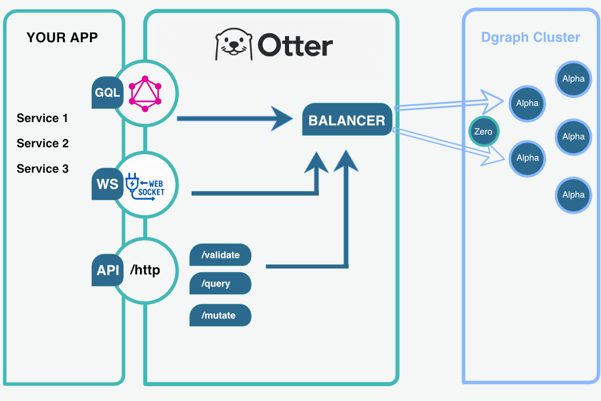

# Otter 🦦

> Under construction 🚧

> Built for performance. Designed for graphs.

Otter is a lightweight, purpose-driven proxy and query transpiler for [Dgraph](https://dgraph.io).  
It intelligently balances traffic between Dgraph clusters and adds support for advanced query workflows — including Cypher-to-DQL translation (in progress).


Otter aims to serve as the foundation for future support of multiple graph languages, offering modular extensions, semantic enrichment, and introspection tools.

# Why this Software?

Read [Why](why.md) this software was created.

---


# Otter Design

Current design.



### Features

-  Round-robin and purpose-based balancing
-  HTTP proxy for Dgraph `/query` and `/mutate`
-  WebSocket server with support for `query`, `mutation`, and `upsert`
-  Simple token-based authentication
-  Configurable via environment variables or YAML

---

## Run Otter with Docker

Requirements

* Clone the repository

* Docker

* Docker Compose

* (optional) make installed

#### Run with make

```bash
make rund
```

 Manual Docker Compose
If you don't have make:

```bash
cd examples/cluster
docker compose up --build
```

#### Configuration
By default, Otter will load config from:

```ini
CONFIG_FILE=/app/manifest/config_docker.yaml
```

If you want to change the config:

```
manifest/config_docker.yaml
```

Or override with environment variables (see internal/config/config.go for supported vars)

---

### Example WebSocket Payload

```json
{
  "type": "upsert",
  "query": "query { u as var(func: eq(email, \"test@example.com\")) }",
  "mutation": "uid(u) <name> \"Test\" .",
  "cond": "@if(eq(len(u), 1))",
  "commitNow": true
}
```

---

### Run Locally

```bash
git clone https://github.com/OpenDgraph/Otter.git
cd Otter
```

```bash
export CONFIG_FILE=./manifest/config.yaml
go run cmd/proxy/main.go
```

Set your balancer strategy inside `config.yaml`:

```yaml
balancer_type: purposeful # or round-robin
```

---

###  HTTP Proxy Endpoints

| Endpoint   | Method | Description         |
|------------|--------|---------------------|
| `/query`   | POST   | Executes a DQL query |
| `/mutate`  | POST   | Executes a mutation  |

Supported Content-Types:

- `application/json`
- `application/dql`

Example request:
```bash
curl -X POST http://localhost:8080/query \
  -H "Content-Type: application/json" \
  -d '{"query": "{ data(func: has(email)) { uid name email } }"}'
```

---

---

### WebSocket Usage

**URL**: `ws://localhost:8089/ws`

#### Supported message types:

- `auth` -> authenticate
- `ping` -> keep connection alive
- `query` / `mutation` / `upsert` → require authentication

#### Example (after auth):

```json
{
  "type": "query",
  "query": "{ data(func: has(email)) { uid name email } }",
  "token": "banana",
  "verbose": true
}
```

###  Load Balancing Modes

Available types:

- `round-robin` *(default)*
- `defined` *(per-purpose: query/mutation/upsert)*

To use `defined`, provide a YAML like this:

```yaml
balancer_type: defined
groups:
  query:
    - localhost:9080
  mutation:
    - localhost:9081
  upsert:
    - localhost:9082
```

---

###  Roadmap

- [ ] Automatic health checks
- [ ] Support for multiple Balancing strategies
- [ ] Graph model abstraction
- [ ] Become a framework

More purposeful Balancing strategies:
- [x] `round-robin` basic round-robin
- [x] `round-robin-purposeful` with purpose
- [ ] `round-robin-healthy` support
- [ ] `round-robin-on-RW` separate readonly and write only
- [ ] `round-robin-avoid-leaders` avoid leaders
- [ ] `round-robin-leaders-only` leaders only
- [ ] `round-robin-state-based` this will check the state of the Alpha and check memory usage and coroutine count
---