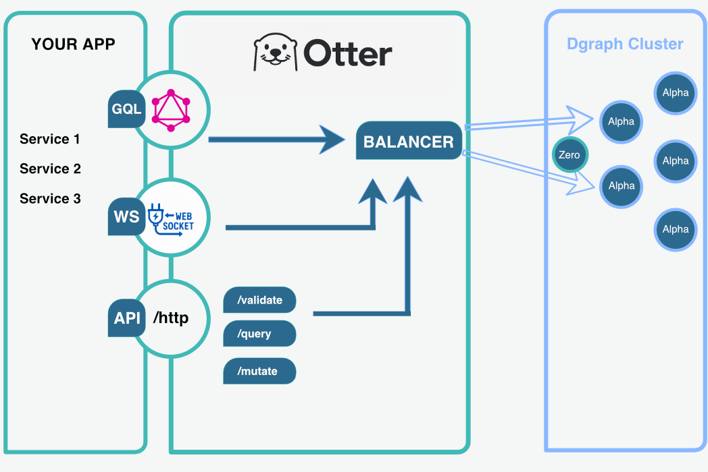

# Otter 🦦

> Under construction 🚧

> Built for performance. Designed for graphs.

Otter is a lightweight, purpose-driven proxy and gateway for
[Dgraph](https://dgraph.io). **Dgraph balances reads at the predicate
level; Otter adds the missing half &mdash; balancing writes across
alphas.** It routes traffic per request purpose (`query` / `mutation`
/ `upsert`), proxies the HTTP admin surface, and exposes a WebSocket
gateway that speaks the same shapes as the HTTP endpoints.

Longer-term, Otter is intended to become the foundation for additional
graph query languages, introspection tooling, and an opinionated
graph-modelling convention on top of Dgraph. Those pieces are
**research directions**, not committed work &mdash; see the
"Later / research" horizon in the roadmap below and the notes in
`why.md` and `internal/loadbalancer/idea.md`.

**Not a goal:** supporting GraphQL as a first-class query language.
Dgraph already ships its own GraphQL layer; Otter only *routes*
`/graphql` pass-through and *reads* Dgraph's GraphQL schema for
introspection tooling (e.g. `/ui/keywords`). Transpiling or
reimplementing GraphQL is explicitly out of scope.

## Why this software?

Read [why.md](why.md) for the long version. The short version: Dgraph
distributes reads across alphas automatically (tablets owned by Raft
groups), but mutations land on a single alpha and are the practical
bottleneck for write-heavy workloads. Otter closes that gap by
letting the operator route each request purpose to a chosen group
of alphas, and &mdash; as cluster-state inspection lands
(see `docs/loadbalancer_audit.md`) &mdash; by making that routing
leader- and health-aware instead of operator-declared.

---


## Design

Current design overview:



## Features

- Round-robin and purposeful load balancing across Dgraph alphas
- HTTP proxy for Dgraph `/query`, `/mutate`, `/alter`, `/graphql`,
  `/health`, `/state`, `/admin/schema`, `/ui/keywords`
- WebSocket gateway with `auth`, `ping`, `query`, `mutation`, `upsert`
- Static `/validate/dql` and `/validate/schema` endpoints (no round-trip)
- Configurable via YAML and environment variables, with dev-vs-production
  safety defaults

## Current Status

- **Working today:** round-robin and purposeful balancing, HTTP proxy for
  `/query`, `/mutate`, `/alter`, `/health`, `/state`, `/admin/schema`,
  `/graphql`, a WebSocket gateway, and YAML + environment configuration.
- **Dev-mode safety defaults:** when `dev_mode: true` (the shipped
  default), the WebSocket handler auto-generates an ephemeral auth token
  at startup and accepts any `Origin`; both are logged as warnings. Set
  `dev_mode: false` with explicit `ws_token` and `ws_allowed_origins` for
  fail-closed behaviour. See `docs/security.md`.
- **Experimental / under audit:** the `purposeful` balancer, the GraphQL
  pass-through, the body-size caps (1 MiB default for HTTP bodies and WS
  messages), and the HTTP server timeouts all ship with conservative
  defaults that have been smoke-tested end-to-end but not stress-tested.
- **Not implemented despite appearing in notes:** health-aware balancing,
  leader-aware routing, Cypher transpilation, and the UID-reservation /
  named-graph convention from `why.md`, `internal/loadbalancer/idea.md`,
  and `docs/design/uid_reservation.md` are research directions, not
  committed work. They are kept in the repo because they shape the
  long-term design.
- **Dgraph version posture:** the Go module depends on
  `hypermodeinc/dgraph/v24` for GraphQL schema handling, while
  `examples/cluster/docker-compose.yml` pins
  `dgraph/dgraph:v25.0.0-preview1`. gRPC traffic is compatible in
  practice but schema behaviour across majors is not guaranteed;
  smoke-test before relying on it.

---

## Development Workflow

Full step-by-step commands live in `docs/runbook.md`. Short version:

- `make test` / `make test-unit` &mdash; fast local tests, no Docker.
- `make e2e-up` + `make e2e-wait` &mdash; boot the Docker stack and wait
  until Otter answers on `/health` and `/query`.
- `make test-e2e` &mdash; run the Docker-backed suite (build tag `e2e`).
- `make e2e` &mdash; one-shot: up, wait, seed, test, tear down.
- `make e2e-down` &mdash; stop the stack and drop its named volumes.

`go test ./...` only runs unit tests; the E2E suite is gated by the
`e2e` build tag so a clean checkout stays green without Docker.

## Testing Strategy

Otter intentionally splits tests into two tiers so contributors can move fast
without Docker, while keeping a deterministic end-to-end path for CI:

| Tier                  | Command              | Docker | Build tag | What it covers                                              |
|-----------------------|----------------------|--------|-----------|-------------------------------------------------------------|
| Unit / internal       | `make test-unit`     | no     | none      | handlers, config, balancers, helpers, parsers, websocket    |
| Default `go test`     | `go test ./...`      | no     | none      | same as unit; E2E packages compile but have no tests exposed |
| Docker-backed E2E     | `make test-e2e`      | yes    | `e2e`     | live HTTP + WS round-trips against a real Dgraph cluster    |
| One-shot E2E          | `make e2e`           | yes    | `e2e`     | up, wait for readiness, seed, run E2E, tear down            |

The `e2e` build tag is the single source of truth. A test that needs a
running Otter on `localhost:8084` / `localhost:8089` must carry the
`//go:build e2e` header so default runs stay hermetic.

Full details, ports, and env vars live in `docs/runbook.md`.

## Quick Start

### With Docker (recommended)

Requirements: Docker + Docker Compose (OrbStack works). `make` is
optional but assumed by the commands below.

```bash
make rund          # foreground, logs streamed
# or
make e2e-up        # background; pair with make e2e-wait
```

If you don't have `make`:

```bash
cd examples/cluster
docker compose up --build
```

### Locally (against an existing Dgraph)

```bash
git clone https://github.com/OpenDgraph/Otter.git
cd Otter
export CONFIG_FILE=./manifest/config.yaml
go run ./cmd/proxy
```

`manifest/config.yaml` points at `localhost:9080` / `localhost:9088`
and uses the `defined` balancer. Edit `balancer_type` to `round-robin`
if you want a single flat list:

```yaml
balancer_type: round-robin
```

## Configuration

Otter loads config from the YAML file pointed to by `CONFIG_FILE`, with
environment variables taking precedence over file values for every knob
that has an env override. The Docker compose example uses
`manifest/config_docker.yaml`; local runs usually point at
`manifest/config.yaml`.

Main knobs (defined in `internal/config/config.go`):

| YAML key              | Env var              | Default       | Purpose                                                        |
|-----------------------|----------------------|---------------|----------------------------------------------------------------|
| `balancer_type`       | `BALANCER_TYPE`      | `round-robin` | `round-robin`, `defined`, or `purposeful`                      |
| `dgraph_endpoints`    | `DGRAPH_ENDPOINTS`   | &mdash;       | Comma-separated alpha endpoints used by round-robin            |
| `groups`              | &mdash;              | &mdash;       | Per-purpose endpoint map (`query`, `mutation`, `upsert`)       |
| `proxy_port`          | `PROXY_PORT`         | `8080`        | HTTP port; Docker example uses `8084`                          |
| `websocket_port`      | `WEBSOCKET_PORT`     | `8089`        | WebSocket port                                                 |
| `enable_http`         | `ENABLE_HTTP`        | `true`        | Toggles the HTTP proxy server                                  |
| `enable_websocket`    | `ENABLE_WEBSOCKET`   | `true`        | Toggles the WebSocket server                                   |
| `graphql`             | `GRAPHQL`            | `true`        | Enables the `/graphql` pass-through                            |
| `dgraph_user`         | `DGRAPH_USER`        | empty         | Dgraph ACL user; optional                                      |
| `dgraph_password`     | `DGRAPH_PASSWORD`    | empty         | Dgraph ACL password; never logged                              |
| `dev_mode`            | `DEV_MODE`           | `true`        | Enables dev-only safety defaults; set `false` for production   |
| `ws_token`            | `WS_TOKEN`           | auto in dev   | WebSocket auth token; required when `dev_mode: false`          |
| `ws_allowed_origins`  | `WS_ALLOWED_ORIGINS` | empty         | Origin allow-list; required when `dev_mode: false`             |
| `max_body_bytes`      | `MAX_BODY_BYTES`     | `1048576`     | HTTP request body cap (1 MiB)                                  |
| `ws_max_message_bytes`| `WS_MAX_MESSAGE_BYTES` | `1048576`   | WebSocket message cap (1 MiB)                                  |
| `ratel`               | `RATEL`              | empty         | Ratel UI host for the `/ratel` redirect                        |
| `ratel_graphql`       | `RATEL_GRAPHQL`      | `true`        | Whether the Ratel redirect carries GraphQL support             |

`dgraph_password` and `ws_token` are redacted from the startup log dump.
See `docs/security.md` for the full security contract.

---

## HTTP Proxy Endpoints

| Endpoint           | Method   | Description                                                                 |
|--------------------|----------|-----------------------------------------------------------------------------|
| `/query`           | POST     | Executes a DQL query via the configured balancer                            |
| `/mutate`          | POST     | Executes a DQL mutation (including upsert blocks)                           |
| `/alter`           | POST     | Schema alter; proxies to the selected alpha                                 |
| `/graphql`         | POST     | Pass-through to Dgraph's `/graphql` (when `graphql: true`)                  |
| `/health`          | GET      | Aggregated Otter + backend health                                           |
| `/state`           | GET      | Proxies Dgraph's `/state` for cluster introspection                         |
| `/admin/schema`    | POST     | GraphQL admin schema update                                                 |
| `/ui/keywords`     | GET      | Keyword list used by Ratel / the Otter UI                                   |
| `/validate/dql`    | POST     | Static validation of a DQL body without execution                           |
| `/validate/schema` | POST     | Static validation of a DQL schema without execution                         |

Supported request Content-Types for DQL endpoints:

- `application/json`
- `application/dql`

Example request (default proxy port is `8084` in the shipped manifests):

```bash
curl -X POST http://localhost:8084/query \
  -H "Content-Type: application/json" \
  -d '{"query": "{ data(func: has(email)) { uid name email } }"}'
```

Request bodies are capped by `max_body_bytes` (default 1 MiB). Bodies
larger than the cap are rejected with HTTP `413 Payload Too Large`.
WebSocket messages are capped separately by `ws_max_message_bytes`
(default 1 MiB); oversized frames are rejected by the WS read path.

---

## WebSocket Usage

**URL**: `ws://localhost:8089/ws`

> Otter ships with `dev_mode: true` by default, which means the WebSocket
> handler auto-generates a random auth token on startup (logged once) and
> accepts every `Origin`. The Docker example pins `ws_token: "banana"` for
> reproducibility &mdash; change it before exposing port 8089.
>
> Set `dev_mode: false` and provide `ws_token` and `ws_allowed_origins`
> (or the `DEV_MODE`, `WS_TOKEN`, `WS_ALLOWED_ORIGINS` env vars) to run
> with the fail-closed behaviour. See `docs/security.md` for details.

Supported message types:

- `auth` &mdash; send first to authenticate the connection
- `ping` &mdash; keep the connection alive
- `query` / `mutation` / `upsert` &mdash; require a prior successful `auth`

Example (after auth; replace the token with the value configured in
`ws_token` or the one printed at Otter startup in dev mode):

```json
{
  "type": "query",
  "query": "{ data(func: has(email)) { uid name email } }",
  "token": "<your ws_token>",
  "verbose": true
}
```

## Load Balancing Modes

Available types:

- `round-robin` *(default)*
- `defined` or `purposeful` *(per-purpose: query/mutation/upsert)*

To use `defined`, provide a YAML like this:

```yaml
balancer_type: defined
groups:
  query:
    - localhost:9080
  mutation:
    - localhost:9081
  upsert:
    - localhost:9082
```

Otter now validates `groups` at startup and fails fast when the map is
empty or any purpose has no usable endpoint.

---

## Roadmap

Organised by horizon so it matches the backlog that contributors can
actually pull from. See `docs/phase1_backlog.md` for the ranked version
with effort and dependency notes.

**Implemented today**

- [x] `round-robin` balancer
- [x] `defined` / `purposeful` balancer with per-purpose groups and
      startup validation
- [x] Configurable WebSocket auth token, origin allow-list, and
      dev-vs-production mode (fail-closed)
- [x] HTTP server with explicit read/write/idle timeouts, body-size
      cap, and SIGINT/SIGTERM graceful shutdown
- [x] Build-tag-gated E2E suite with Docker-backed `make e2e` one-shot
- [x] Redacted config log dump (password and WS token)

**Now (nearest-term follow-ups)**

- [ ] Structured logging (`log/slog`), request IDs, basic metrics
- [x] Translate oversize-body rejections to HTTP 413 explicitly
- [x] Cap incoming WebSocket messages (`ws_max_message_bytes`)
- [ ] Basic per-IP rate limiting on `/query`, `/mutate`, `/graphql`, `/ws`

**Next**

- [ ] Health-aware round-robin (`round-robin-healthy`)
- [ ] Read/write split balancer (`round-robin-on-RW`)
- [ ] Cluster state inspection that feeds balancer decisions
- [ ] Container health-checks backed into `docker-compose.yml`
      (removing the host-side `scripts/wait-for-otter.sh` stopgap)

**Later / research**

Tracked in `why.md`, `internal/loadbalancer/idea.md`, and the
discussion docs under `docs/design/`. These are *vision documents*,
not committed scope:

- Leader-aware routing (`round-robin-avoid-leaders`,
  `round-robin-leaders-only`)
- State-based balancing using `/state` and resource introspection
- UID-reservation / named-graph convention
  (see `docs/design/uid_reservation.md`)
- Predicate-prefix sharding on top of named graphs
- Cypher / other transpilers (see `internal/astneo`)
- Otter-as-framework

---
